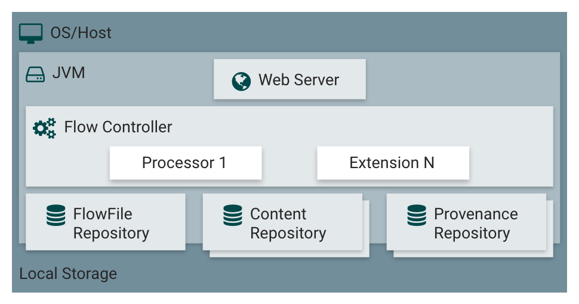

# Apache NiFi

NiFi was built to automate the flow of data between systems. While the term 'dataflow' is used in a variety of contexts, here it means the automated and managed flow of information between systems.

- Automate the flow of data between systems.
  - E.g.: JSON -> Database, FTP -> Hadoop, Kafka -> Elasticsearch
- Drag and drop interface
- Focus on configuratino of processors
- Scalable across a cluster of machines
- Guaranteed Delivery / No Data Loss

## Is good at
- Reliable and secure transfer of data between systems
- Delivery of data from sources to analytic platforms
- Enrichment and preparation of data:
    - Conversion between formats
    - Extraction/Parsing
    - Routing decisions


## Shouldn't be used
- Distributed Computation
- Complex Event processing
- Joins, rolling windows, aggregations operations

## Core Concepts
- **FlowFile**: A FlowFile represents each object moving through the system and for each one, NiFi keeps track of a map of key/value pair attribute strings and its associated content of zero or more bytes.
- **FlowFile Processor**: Processors actually perform the work. A processor is doing some combination of data routing, transformation, or mediation between systems. Processors have access to attributes of a given FlowFile and its content stream. Processors can operate on zero or more FlowFiles in a given unit of work and either commit that work or rollback.
- **Connection**: Connections provide the actual linkage between processors. These act as queues and allow various processes to interact at differing rates. These queues can be prioritized dynamically and can have upper bounds on load, which enable back pressure.
- **Flow Controller**: The Flow Controller maintains the knowledge of how processes connect and manages the threads and allocations thereof which all processes use. The Flow Controller acts as the broker facilitating the exchange of FlowFiles between processors.
- **Process Group**: A Process Group is a specific set of processes and their connections, which can receive data via input ports and send data out via output ports. In this manner, process groups allow creation of entirely new components simply by composition of other components.

## Architecture
<p align="center">
    
</p>

NiFi executes within a JVM on a host operating system. The primary components of NiFi on the JVM are as follows:
- **Web Server**: The purpose of the web server is to host NiFi’s HTTP-based command and control API.
- **Flow Controller**: The flow controller is the brains of the operation. It provides threads for extensions to run on, and manages the schedule of when extensions receive resources to execute.
- **Extensions**: There are various types of NiFi extensions which are described in other documents. The key point here is that extensions operate and execute within the JVM.
- **FlowFile Repository**: contains metadata for all the current FlowFiles in the flow. The FlowFile Repository is where NiFi keeps track of the state of what it knows about a given FlowFile that is presently active in the flow. The default approach is a persistent Write-Ahead Log located on a specified disk partition.
- **Content Repository**: holds the content for current and past FlowFiles. The Content Repository is where the actual content bytes of a given FlowFile live. More than one file system storage location can be specified so as to get different physical partitions engaged to reduce contention on any single volume.
- **Provenance Repository**: holds the history of FlowFiles. This history is used to provide the Data Lineage (also known as the Chain of Custody) of each piece of data. While monitoring a dataflow, users often need a way to determine what happened to a particular data object (FlowFile). NiFi’s Data Provenance page provides that information. Because NiFi records and indexes data provenance details as objects flow through the system, users may perform searches, conduct troubleshooting and evaluate things like dataflow compliance and optimization in real time. By default, NiFi updates this information every five minutes, but that is configurable.

<p align="center">
    
</p>

Starting with the NiFi 1.0 release, a Zero-Leader Clustering paradigm is employed. Each node in a NiFi cluster performs the same tasks on the data, but each operates on a different set of data.

Apache ZooKeeper elects a single node as the Cluster Coordinator, and failover is handled automatically by ZooKeeper. All cluster nodes report heartbeat and status information to the Cluster Coordinator. The Cluster Coordinator is responsible for disconnecting and connecting nodes. Additionally, every cluster has one Primary Node, also elected by ZooKeeper. As a DataFlow manager (DFM), you can interact with the NiFi cluster through the user interface (UI) of any node. Any change you make is replicated to all nodes in the cluster, allowing for multiple entry points.

When a new node elects to join the cluster, the new node must first connect to the currently-elected Cluster Coordinator in order to obtain the most up-to-date flow. If the Cluster Coordinator determines that the node is allowed to join (based on its configured Firewall file), the current flow is provided to that node, and that node is able to join the cluster, assuming that the node’s copy of the flow matches the copy provided by the Cluster Coordinator. If the node’s version of the flow configuration differs from that of the Cluster Coordinator’s, the node will not join the cluster.


When NiFi first starts up, the following files and directories are created:

- content_repository
- database_repository
- flowfile_repository
- provenance_repository
- work directory
- logs directory

Within the conf directory, the *flow.xml.gz* file is created.

### Terminology
NiFi Clustering is unique and has its own terminology. It’s important to understand the following terms before setting up a cluster:

**NiFi Cluster Coordinator**: A NiFi Cluster Coordinator is the node in a NiFi cluster that is responsible for carrying out tasks to manage which nodes are allowed in the cluster and providing the most up-to-date flow to newly joining nodes. When a DataFlow Manager manages a dataflow in a cluster, they are able to do so through the User Interface of any node in the cluster. Any change made is then replicated to all nodes in the cluster.

**Nodes**: Each cluster is made up of one or more nodes. The nodes do the actual data processing.

**Primary Node**: Every cluster has one Primary Node. On this node, it is possible to run "Isolated Processors". ZooKeeper is used to automatically elect a Primary Node. If that node disconnects from the cluster for any reason, a new Primary Node will automatically be elected. Users can determine which node is currently elected as the Primary Node by looking at the Cluster Management page of the User Interface.

**Isolated Processors**: In a NiFi cluster, the same dataflow runs on all the nodes. As a result, every component in the flow runs on every node. However, there may be cases when the DFM would not want every processor to run on every node. The most common case is when using a processor that communicates with an external service using a protocol that does not scale well. For example, the GetSFTP processor pulls from a remote directory. If the GetSFTP Processor runs on every node in the cluster and tries simultaneously to pull from the same remote directory, there could be race conditions. Therefore, the DFM could configure the GetSFTP on the Primary Node to run in isolation, meaning that it only runs on that node. With the proper dataflow configuration, it could pull in data and load-balance it across the rest of the nodes in the cluster. Note that while this feature exists, it is also very common to simply use a standalone NiFi instance to pull data and feed it to the cluster. It just depends on the resources available and how the Administrator decides to configure the cluster.

**Heartbeats**: The nodes communicate their health and status to the currently elected Cluster Coordinator via "heartbeats", which let the Coordinator know they are still connected to the cluster and working properly. By default, the nodes emit heartbeats every 5 seconds, and if the Cluster Coordinator does not receive a heartbeat from a node within 40 seconds (= 5 seconds * 8), it disconnects the node due to "lack of heartbeat". The 5-second and 8 times settings are configurable in the *nifi.properties* file. The reason that the Cluster Coordinator disconnects the node is because the Coordinator needs to ensure that every node in the cluster is in sync, and if a node is not heard from regularly, the Coordinator cannot be sure it is still in sync with the rest of the cluster. If, after 40 seconds, the node does send a new heartbeat, the Coordinator will automatically request that the node re-join the cluster, to include the re-validation of the node’s flow. Both the disconnection due to lack of heartbeat and the reconnection once a heartbeat is received are reported to the DFM in the User Interface.


### Managing Nodes
#### Disconnect Nodes
A DFM may manually disconnect a node from the cluster. A node may also become disconnected for other reasons, such as due to a lack of heartbeat. The Cluster Coordinator will show a bulletin on the User Interface when a node is disconnected. The DFM will not be able to make any changes to the dataflow until the issue of the disconnected node is resolved. The DFM or the Administrator will need to troubleshoot the issue with the node and resolve it before any new changes can be made to the dataflow. However, it is worth noting that just because a node is disconnected does not mean that it is not working. This may happen for a few reasons, for example when the node is unable to communicate with the Cluster Coordinator due to network problems.

#### Flow Election
When a cluster first starts up, NiFi must determine which of the nodes have the "correct" version of the flow. This is done by voting on the flows that each of the nodes has. When a node attempts to connect to a cluster, it provides a copy of its local flow and (if the policy provider allows for configuration via NiFi) its users, groups, and policies, to the Cluster Coordinator. If no flow has yet been elected the "correct" flow, the node’s flow is compared to each of the other Nodes' flows. If another Node’s flow matches this one, a vote is cast for this flow. If no other Node has reported the same flow yet, this flow will be added to the pool of possibly elected flows with one vote. After some amount of time has elapsed (configured by setting the nifi.cluster.flow.election.max.wait.time property) or some number of Nodes have cast votes (configured by setting the nifi.cluster.flow.election.max.candidates property), a flow is elected to be the "correct" copy of the flow.

## Apache NiFi Registry
Registry (a subproject of Apache NiFi) is a complementary application that provides a central location for storage and management of shared resources across one or more instances of NiFi and/or MiNiFi.
## How to Run
```shell
docker-compose up -d
```
You may have to change permissions for the NiFi volumes that are mapped.

### Nifi
Accessible at [localhost:8443](https://localhost:8443/nifi).

### Nifi Registry
Accessible at [localhost:18080](http://localhost:18080/nifi-registry).

Specific goals for the initial thrust of the Registry effort include:

- Implementation of a Flow Registry for storing and managing versioned flows.
- Integration with NiFi to allow storing, retrieving, and upgrading versioned flows from a Flow Registry.
- Administration of the Registry for defining users, groups, and policies

## References
- [Apache NiFi Docs](https://nifi.apache.org/docs.html)
- [Stephane Maarek](https://www.youtube.com/watch?v=-T9xuBMfI50&ab_channel=StephaneMaarek)
- [Introduction nifi best practices](https://capgemini.github.io/development/introduction-nifi-best-practices/)
- [Docker Hub](https://hub.docker.com/r/apache/nifi)
- [Registry](https://nifi.apache.org/registry.html)
